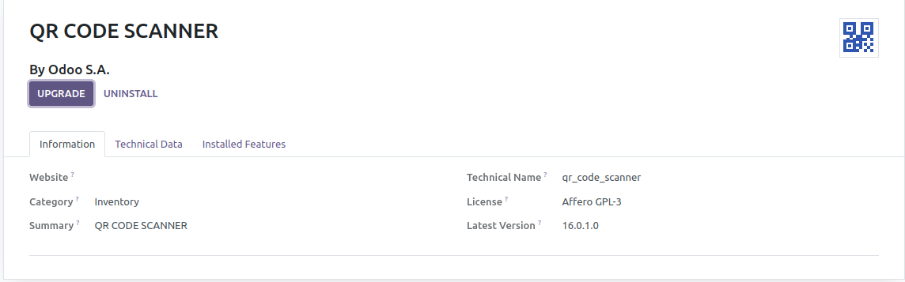

  # QR-CODE-SCANNER

  # QR Code Scanner Module for Odoo V15-V16 Community Version

The QR Code Scanner module for Odoo allows users to scan QR codes containing predefined data formats and automatically create records in the `res.partner` model. If a record already exists for the scanned QR code, an error message will be displayed.

## Features

- Scan QR codes to create partner records.
- Prevents duplicate partner records for the same QR code.

## Installation

To install and use this module, follow these steps:

1. Download the module from [GitHub Repository](https://github.com/sajjad-yousuf-96/QR-CODE-SCANNER).

2. Extract the module files to your Odoo addons directory.

3. Restart the Odoo server to load the new module:

   ```bash
   odoo-bin -c /path/to/odoo.conf
4. Log in to your Odoo instance as an administrator.

5. Go to the "Apps" menu and search for "QR Code Scanner."

6. Install the module.
   


## Usage
Once the module is installed, you can use the QR Code Scanner functionality as follows:

Navigate to the QR CODE menu.

Click on the "Tap To Scan" button or option (customize this according to your module's UI).

Use your device's camera(if laptop then the webcam will automatically opens) to scan the QR code.

The module will process the scanned data and attempt to create a new partner record or update an existing one.

Example of QR CODE Data
'''
Full name: Muhammad Sajjad

ID: 002389521NE041

Province: NAMIBE 

Birthday: 08/04/2007 

Sex: Feminino 

Marital status: SOLTEIRO 

ID issue date: 08/12/2017 

ID Exp date: 08/12/2027 

Issue Province: LUANDA
'''
Example QR Code in static/img/example_qr.png
Anyone can make changes in controller file depend upon the data in qr code

If a record is successfully created or updated, you will see a success message.

If a record with the same QR code data already exists, you will receive an error message indicating that duplicates are not allowed.

Support and Issues
If you encounter any issues, have questions, or need assistance, you can contact me on <a href="sajjad.yousuf.96@gmail.com">sajjad.yousuf.96@gmail.com</a>.

License
This Odoo module is released under the MIT License.

Acknowledgments
This module was developed by <a href="https://github.com/sajjad-yousuf-96">Muhammad Sajjad</a>.

[](https://youtu.be/QKubQ79sFhw)
